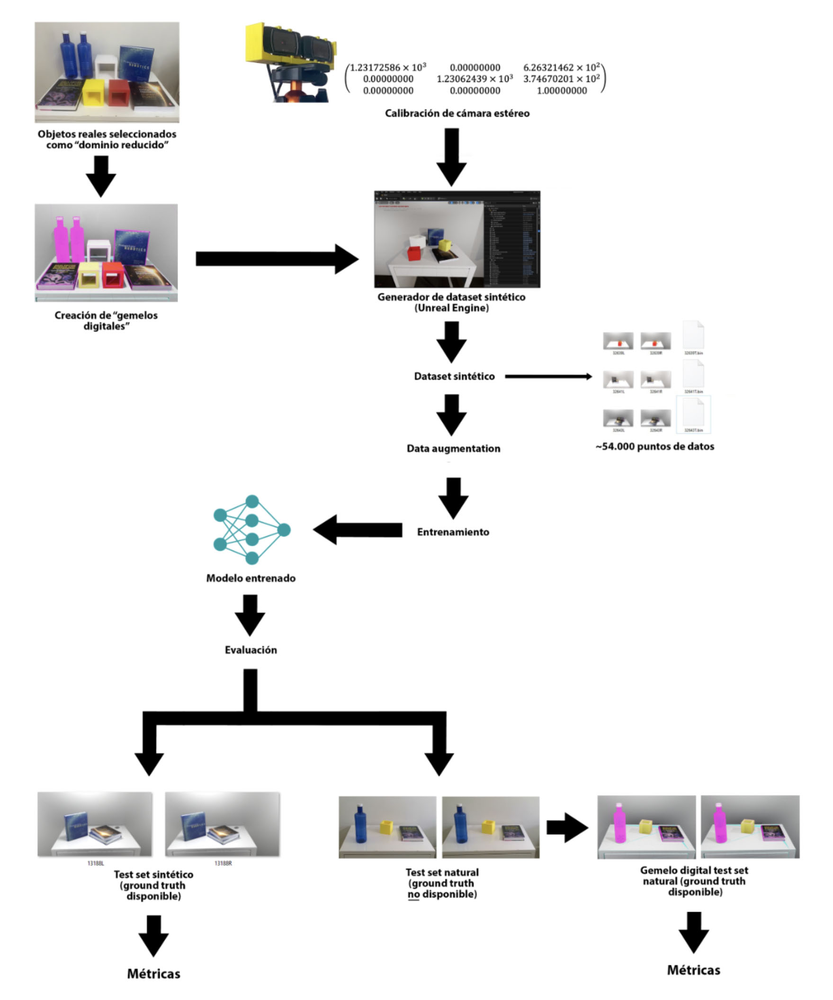
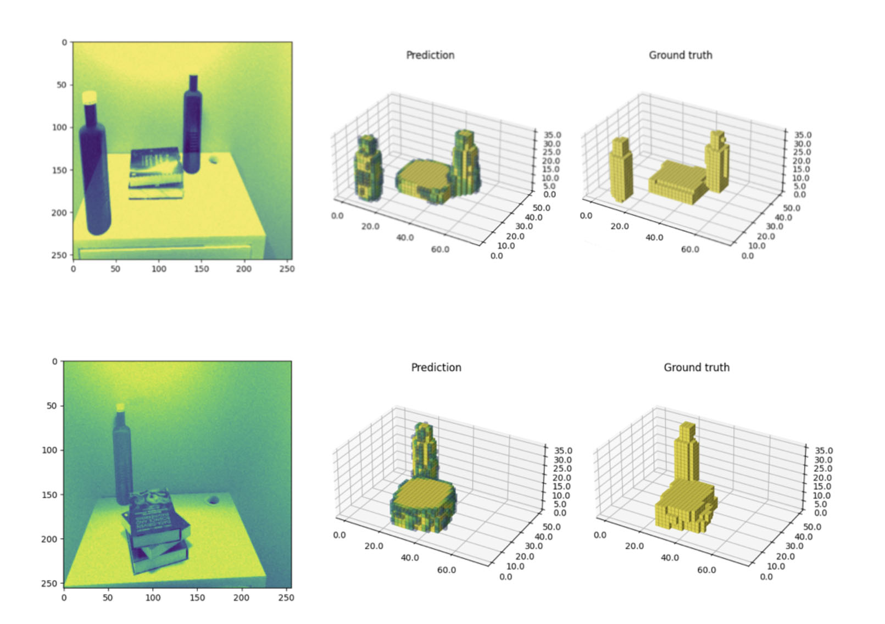
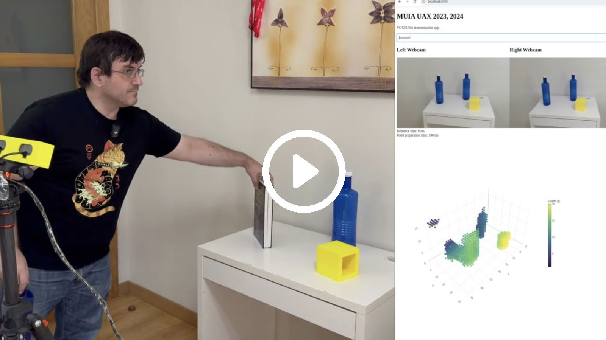

# MUIAUAX-TFM
TFM Master Universitario en Inteligencia Artificial UAX

Este repositorio contiene todo el código utilizado en el desarrollo del TFM para el MUIA UAX 2023, 2024 de Emilio Pomares

This repository contains the code for the Final Project of the Master's Degree in Artificial Intelligence from Universidad Alfonso X el Sabio.

The goal of the project is to train a CNN-based network to translate a pair of stereo images coming from a stereo camera
into a voxel-based 3D occupancy grid. Applications range from obstacle navigation to robotic manipulation.

This image shows how the working space is divided into a 3D grid of cells which can be occupied or not.

The goal of the model is to predict as **occupied** only the cells which overlap objects in the working area.

The network is a U-Net inspired CNN that processes 2D images in the encoding section, and reconstructs 3D images in the decoding. Residual connections allow information to flow from the encoding layers into the decoding ones.

To train the network, a **synthetic dataset** was generated, plus a careful procedure to **estimate ground truth** from actual stereo images taken with a camera. The overall workflow is shown in this image:

This images shows the input to the model next to predictions and ground truth.

The model runs smoothly in real-time in modest GPUS. A demo application is included with the project. Check out the **demo video** to see the model working in real-time with both **in-distribution** and **out-of-distribution** obstacles:

This project was awarded top marks by the Commitee.
